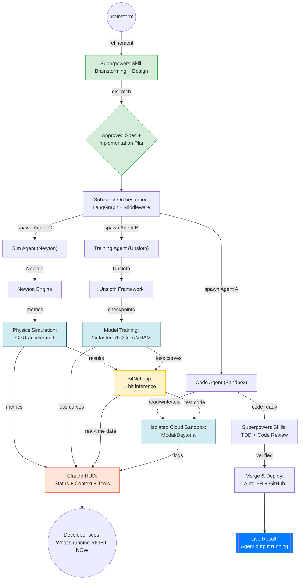

# AI Dev OS Architecture

## Overview

AI Dev OS is a unified platform for autonomous AI agent development, combining:

- **Deep Agents** (LangGraph) - Core orchestration engine
- **Superpowers** - Mandatory workflow enforcement
- **Newton** - GPU physics simulation
- **Unsloth** - 2x faster model training
- **BitNet** - Efficient 1-bit LLM inference
- **Claude HUD** - Real-time observability

### Unified Platform Architecture

The following diagram illustrates the integrated flow of the six core technologies within AI Dev OS, as defined in the official platform design board:


**[Official Figma Board: Unified AI Platform Architecture](https://www.figma.com/board/A4TS4yuzBMF9g3IiMcdrBu/unified_ai_platform_architecture?node-id=0-1&t=C9sd6PrCRYsozLOb-0)**



## System Architecture

```
┌─────────────────────────────────────────────────────────────────┐
│                        User Interface                            │
│              Slack / Linear / GitHub / Claude Code              │
└────────────────────────┬────────────────────────────────────────┘
                         │
┌────────────────────────▼────────────────────────────────────────┐
│               AI Dev OS Orchestrator (core.py)                   │
│         AIDevOSOrchestrator + SubagentOrchestrator             │
│                                                                  │
│  ┌─────────────────────────────────────────────────────────┐   │
│  │  Workflow State Machine                                 │   │
│  │  - Brainstorming → Planning → Execution → Validation  │   │
│  └─────────────────────────────────────────────────────────┘   │
│                                                                  │
│  ┌─────────────────────────────────────────────────────────┐   │
│  │  Superpowers Skill Loader                               │   │
│  │  - brainstorming, planning, code-review                │   │
│  │  - test-driven-development, verification               │   │
│  └─────────────────────────────────────────────────────────┘   │
│                                                                  │
│  ┌─────────────────────────────────────────────────────────┐   │
│  │  Context Window Management                              │   │
│  │  - Track usage (real-time to Claude HUD)               │   │
│  │  - Auto-summarize at 75%, emergency at 90%             │   │
│  └─────────────────────────────────────────────────────────┘   │
└────────────────┬─────────────────────────┬──────────────────────┘
                 │                         │
        ┌────────▼──────┐         ┌────────▼──────┐
        │  Subagent A   │         │  Subagent B   │
        │   (Code)      │         │  (Training)   │
        │               │         │               │
        │ Sandbox Pool  │         │ Sandbox Pool  │
        └────────┬──────┘         └────────┬──────┘
                 │                         │
        ┌────────▼──────────────────────────▼──────┐
        │         Sandbox Layer (sandbox.py)       │
        │                                           │
        │  ┌────────┐ ┌────────┐ ┌─────────┐      │
        │  │ Modal  │ │ Docker │ │ Daytona │ ...  │
        │  └────────┘ └────────┘ └─────────┘      │
        │                                           │
        │  Isolated execution environments         │
        └────────┬──────────────────────────────────┘
                 │
        ┌────────▼──────────────────────┐
        │    Model/Training Layer        │
        │                                │
        │  ┌──────────────────────────┐ │
        │  │  Unsloth Training Wrapper│ │
        │  │  - 2x speedup            │ │
        │  │  - 70% less VRAM         │ │
        │  │  - Multi-GPU support     │ │
        │  └──────────────────────────┘ │
        │                                │
        │  ┌──────────────────────────┐ │
        │  │  BitNet Inference Engine │ │
        │  │  - 1-bit models          │ │
        │  │  - CPU optimized         │ │
        │  │  - <50ms latency         │ │
        │  └──────────────────────────┘ │
        │                                │
        │  ┌──────────────────────────┐ │
        │  │  Newton Physics Sim      │ │
        │  │  - GPU-accelerated       │ │
        │  │  - Parallel episodes     │ │
        │  └──────────────────────────┘ │
        └────────┬──────────────────────┘
                 │
        ┌────────▼──────────────────────┐
        │    Claude HUD Integration      │
        │    (hud.py)                    │
        │                                │
        │  Real-time terminal display:  │
        │  - Context usage %            │
        │  - Active agents              │
        │  - Tool activity              │
        │  - Progress tracking          │
        └────────────────────────────────┘
```

## Component Deep Dive

### 1. Core Orchestrator (core.py)

**Responsibility**: Coordinates the entire workflow lifecycle.

**Key Classes**:
- `AIDevOSOrchestrator` - Main entry point
- `SubagentOrchestrator` - Manages parallel subagents
- `SuperpowerSkill` - Skill execution wrapper
- `WorkflowState` - Workflow state machine
- `ClaudeHUDIntegration` - Real-time status updates

**Workflow Phases**:
```python
WorkflowPhase.BRAINSTORMING  # Design refinement
    ↓
WorkflowPhase.PLANNING       # Task breakdown
    ↓
WorkflowPhase.EXECUTION      # Parallel subagents
    ↓
WorkflowPhase.VALIDATION     # Code review
    ↓
WorkflowPhase.MERGE          # PR creation
```

**Example Flow**:
```python
orchestrator = AIDevOSOrchestrator(sandbox_provider=SandboxProvider.MODAL)
state = await orchestrator.run("Build authentication module")

# State transitions through phases automatically
# At each phase, Superpowers skill is invoked
# Subagents execute in parallel
# Claude HUD updates in real-time
```

### 2. Sandbox Layer (sandbox.py)

**Responsibility**: Isolate agent execution in cloud sandboxes.

**Architecture**:
```
SandboxFactory (interface)
    ├─ ModalSandbox (production)
    ├─ DockerSandbox (local development)
    ├─ DaytonaSandbox (community)
    └─ CustomSandbox (extensible)
```

**Sandbox Lifecycle**:
```
SandboxConfig
    ↓
SandboxFactory.create(config)
    ↓
Sandbox.initialize() → returns sandbox_id
    ↓
Sandbox.execute(command)
    ↓
Sandbox.upload_file / download_file
    ↓
Sandbox.terminate()
```

**Features**:
- Isolated filesystem (repo cloned in)
- Full shell access
- GPU support (Modal, Docker)
- File mounting for input/output
- Automatic error recovery

### 3. Model Layer (models.py)

**Responsibility**: Unified training and inference interface.

**Components**:

#### UnslothTrainer
```python
trainer = UnslothTrainer(config)
success, metrics = await trainer.train()
# Returns: final_loss, perplexity, speedup, vram_savings
await trainer.quantize_to_bitnet(output_dir)
```

Features:
- 2x speedup vs standard training
- 70% VRAM savings
- Multi-GPU support
- Auto-checkpoint
- BitNet quantization

#### BitNetInference
```python
engine = BitNetInference(model_path)
await engine.load()
success, output = await engine.infer(prompt, max_tokens=512)
# Runs on CPU with <50ms latency
```

Features:
- 1-bit model inference
- CPU-optimized (no GPU needed)
- Batch inference support
- Fast (5+ tokens/sec on CPU)

#### ModelManager
```python
manager = ModelManager()
await manager.train_model(config)  # Full training pipeline
await manager.load_inference_engine(path, model_id)
success, output = await manager.infer(model_id, prompt)
```

### 4. Integration Layer

#### Slack Integration
```python
@bot.command("openswe")
async def handle_slack_message(channel, thread_ts, text):
    # Parse repo:owner/name syntax
    # Create workflow state
    # Post status updates in thread
    # Share PR link when ready
```

#### Linear Integration
```python
@bot.webhook("linear_comment")
async def handle_linear_comment(issue_id, comment_text):
    # Read full issue context
    # Create workflow
    # Post results as comment
    # React with emoji
```

#### GitHub Integration
```python
@bot.webhook("github_pr_comment")
async def handle_review_feedback(pr_id, comment):
    # Read PR diff
    # Address feedback
    # Push commits to same branch
    # Reply with summary
```

## Data Flow

### Typical Workflow

```
1. USER REQUEST (Slack)
   "Build auth module with tests"
   ↓
2. BRAINSTORMING (Claude + Superpowers)
   Design → Design Doc (validated by user)
   ↓
3. PLANNING (Claude + Superpowers)
   Plan → Task Breakdown (each 2-5 minutes)
   ↓
4. EXECUTION (Subagents in parallel)
   Agent-A: Code in Sandbox-1
   Agent-B: Training in Sandbox-2
   Agent-C: Sim in Sandbox-3
   ↓
5. REAL-TIME UPDATES (Claude HUD)
   Context: 45% | Agents: 3 active | Task: 2/3
   ↓
6. VALIDATION (Code Review + Tests)
   Review → Issues Found/Approved
   ↓
7. MERGE (Auto-PR Creation)
   Commit → PR → Link in Slack
```

## Context Window Management

Critical for long-running workflows with large models (200K tokens):

```
Initial: 0%
Brainstorming: 15%
Planning: 28%
Execution: 50-80%
    ↓ 75% threshold
    [WARNING] Context usage high
    [OPTION] Auto-summarize and commit
Validation: 65%
Merge: 40%
```

**Algorithm**:
```python
def check_context():
    usage = state.context_usage_percent
    
    if usage >= 90:
        # CRITICAL: Auto-save and abort
        await save_state()
        return "CRITICAL"
    
    elif usage >= 75:
        # WARNING: Offer to summarize
        offer_summarization()
        return "WARNING"
    
    else:
        return "OK"
```

## Extensibility

### Adding a New Skill

```python
# 1. Create skill class
class NewSkill(SuperpowerSkill):
    async def execute(self, state: WorkflowState) -> str:
        # Your logic
        return result

# 2. Register in AIDevOSOrchestrator
self.skills["new-skill"] = NewSkill(...)

# 3. Invoke in workflow
result = await self.skills["new-skill"].execute(state)
```

### Adding a Custom Sandbox

```python
# 1. Subclass Sandbox
class CustomSandbox(Sandbox):
    async def initialize(self) -> str: ...
    async def execute(self, command) -> Tuple[int, str, str]: ...
    # ... implement other abstract methods

# 2. Register in factory
SandboxFactory.register("custom", CustomSandbox)

# 3. Use
sandbox = await create_sandbox("custom", "my-task")
```

### Adding a Custom Tool

```python
# 1. Define in Superpowers skill
# or in subagent tools list

# 2. Implement execution logic
async def my_tool(params):
    # Your implementation
    return result

# 3. Document in AGENTS.md
```

## Performance Characteristics

### Throughput
- **Code Gen**: 200-500 tokens/sec (Claude Opus)
- **Training**: 2x faster with Unsloth
- **Inference**: 5+ tokens/sec (1-bit models on CPU)
- **Simulation**: 1000+ FPS per GPU (Newton)

### Latency
- **Brainstorming**: 30-60 sec
- **Planning**: 60-120 sec
- **Per-Task Execution**: 2-5 minutes
- **Code Review**: 30-60 sec
- **Context Check**: <10ms

### Resource Usage
- **Base Memory**: 2-4 GB
- **Per Subagent**: 4-8 GB (code), 8-16 GB (training)
- **GPU**: Optional (Modal provides)
- **Context Window**: 50-100K tokens per agent

## Monitoring & Observability

### Claude HUD (Real-time Terminal)
```
[Opus | Max] │ my-project git:(feature/auth)
Context ████████░░ 78% │ Usage ███░░░░░░░ 32% (2h 15m / 5h)
◐ Code: auth.ts ✓ Read ×12 | ✓ Write ×3
◐ Train [agent-B]: Loss 1.234 (45m / 60m)
▸ Phase 2: Code + Training (3/5) ✓✓✓
```

### Logs
- `~/.ai-dev-os/logs/agents.log` - Agent execution
- `~/.ai-dev-os/logs/sandbox.log` - Sandbox operations
- `~/.ai-dev-os/logs/training.log` - Model training
- `.ai-dev-os/workflow_<id>.json` - Complete workflow state

### Metrics Dashboard (Optional)
```
Endpoint: http://localhost:8000
- Running agents (live)
- Context usage trends
- Completed workflows
- PR creation rate
```

## Security & Safety

### Isolation Layers
1. **Code Isolation**: Agent code runs in sandbox only
2. **File Isolation**: No access to host filesystem (mounts read-only)
3. **API Isolation**: Only approved APIs callable
4. **Resource Limits**: CPU, RAM, GPU quotas per sandbox
5. **Audit Logging**: All operations logged with timestamps

### Safety Checks
1. **Mandatory Code Review**: Before any merge
2. **Test Coverage**: >= 80% required
3. **Static Analysis**: Black, isort, mypy checks
4. **Linting**: flake8 + custom rules
5. **Manual Approval**: At Brainstorming + Merge phases

---

For detailed setup instructions, see **SETUP_GUIDE.md**.
